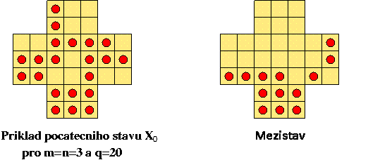

mi-ppr-krs
==========

MI-PPR.2: Semestrálka KRS

    make

    make VERBOSE=yes

Úloha KRS: Křížový solitér
==========================

Vstupní data:
-------------

 * m,n = rozměry obdélníka, m>=n>=3 
 * q=přirozené číslo, M-m-n>=q>=1, kde M = m*n + 4m + 4n
 * x=přirozené číslo, 1q>x>=1
 * F[1..q]=souřadnice náhodně rozmístěných koleček na počátku

Pravidla hry:
-------------

Herní deska se skládá z M políček, které jsou uspořádány do 5 obdélníků: Obdélník m x n, označený S(třed), ke kterému jsou na všech čtyřech stranách připojeny další 4 obdélníky, 2 obdelníky o velikosti m x 2 označené L(evý) a P(ravý) a 2 obdélníky n x 2, označené H(orní) a D(olní), viz obrázek vlevo

Políčka jsou číslovaná 1, …, M v pořadí zleva doprava shora dolů.

Jeden tah je vodorovný nebo svislý (nikoli úhlopříčný) přeskok kolečka, za kterým je volno a odstranění přeskočeného kolečka.

Generování počátečního stavu:
-----------------------------

X0 vygenerujeme nejprve x náhodně rozmístěných izolovaných koleček a z tohoto stavu pak provedeme q-x+1 zpětných tahů a získáme počáteční stav s q+1 kolečky. Zpětné provádění tahů znamená, že za sebou jdoucí svislá nebo vodorovná trojice políček, z nichž pouze 1 krajní je obsazeno kolečkem, se nahradí trojicí políček, ve které jsou naopak obsazeny obě původně volná políčka. Toto zpětné provádění tahů by mělo být úspěšné, bude-li q nejvýše M-n-m. Příklad počátečního stavu je na obrázku vlevo.

Úkol:
-----

Cílem hry je najít posloupnost tahů, kterými se odstraní všechna kolečka až na minimální počet izolovaných koleček, které již nejdou odstranit. V ideálním případě zbývá pouze kolečko 1 a víme, že existuje řešení s nejvýše x izolovanými kolečky.

Výstup algoritmu:
-----------------

Posloupnost tahů vedoucích k řešení.

Sekvenční algoritmus:
---------------------

Sekvenční algoritmus typu [BB-DFS](https://edux.fit.cvut.cz/courses/MI-PPR.2/labs/prohledavani_do_hloubky) s hloubkou prohledávaného prostoru omezenou na q. Prohledávání stavového prostoru je uplné v závislosti na vstupních datech. Cena, kterou minimalizujeme, je počet izolovaných koleček.

Triviální spodní mez je rovna jedné, tj. v okamžiku, kdy na hrací ploše již zbývá jen jedno kolečko, nemá smysl v prohledávání dále pokračovat.

Paralelní algoritmus:
---------------------

Paralelní algoritmus je typu [PBB-DFS-D](https://edux.fit.cvut.cz/courses/MI-PPR.2/labs/prohledavani_do_hloubky).
